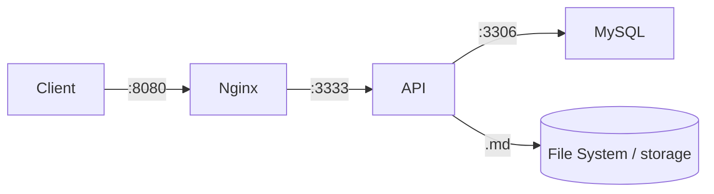

# 🚀 CodeHub

O **CodeHub** é um sistema centralizado e um inventário inteligente para armazenamento, categorização e recuperação rápida de artefatos de código. Ele foi projetado para evitar o retrabalho na construção de infraestrutura base, armazenando *snippets* reutilizáveis, arquivos de configuração (Docker, Nginx, CI/CD), middlewares e scripts utilitários.

## 🏗️ Arquitetura e Stack Tecnológica

O projeto foi construído sob uma arquitetura de **Monorepo** e utiliza uma abordagem de **Armazenamento Híbrido**:

- **Indexação e Taxonomia:** MySQL (relacionamentos, categorias e tags).
- **Armazenamento de Conteúdo:** File System local, com arquivos Markdown (`.md`) usando Frontmatter para metadados e suporte a diagramas Mermaid.

**Stack Principal:**

- **Backend:** Node.js, TypeScript, Express.js (arquitetura limpa: Routes → Controllers → Services → Repositories).
- **Validação:** Zod. **Testes:** Jest (TDD estrito na camada de Services).
- **Banco de Dados:** MySQL (driver `mysql2`, SQL puro).
- **Infraestrutura:** Docker, Nginx, GitHub Actions (CI).

## 📂 Estrutura do Monorepo (Workspaces)

```text
codehub/
├── docs/                 # Documentação base (PDD, SDD, TDD, ROADMAP)
├── app/
│   ├── api/              # Backend (Node.js + Express) — inclui o Dockerfile
│   └── web/              # Frontend (React + Vite + TypeScript + Tailwind)
├── infra/
│   └── nginx/            # Configuração do proxy reverso (Nginx)
├── .github/workflows/    # Pipeline de CI (lint + test + build)
├── docker-compose.yml    # Orquestra API + MySQL + Nginx
└── claude.md             # Diretrizes arquiteturais e regras de IA
```

## 🐳 Como rodar (Docker — recomendado)

Sobe a stack completa — **API + MySQL + Nginx** — com a migration do banco aplicada **automaticamente** na primeira execução.

> **Pré-requisito:** Docker + Docker Compose instalados.

```bash
# 1. Builda as imagens
docker compose build

# 2. Sobe os serviços em segundo plano (-d = detached)
docker compose up -d
```

A API fica acessível, através do Nginx, em **http://localhost:8080**.

**Verifique se subiu:**

```bash
curl http://localhost:8080/health
# {"status":"ok","service":"codehub-api"}
```

**Endpoints disponíveis:**

| Recurso | Rota base |
| --- | --- |
| Snippets | `/api/snippets` |
| Tipos de projeto | `/api/types` |
| Tags | `/api/tags` |

**Operação:**

```bash
docker compose ps          # status dos containers
docker compose logs -f api # acompanha os logs da API
docker compose down        # para tudo (mantém os dados nos volumes)
docker compose down -v     # para e APAGA os volumes (zera MySQL + storage dos .md)
```

**Variáveis de ambiente (opcionais — têm default):** crie um `.env` na raiz para sobrescrever.

| Variável | Default | |
| --- | --- | --- |
| `DB_PASSWORD` | `root` | senha do root do MySQL |
| `DB_NAME` | `codehub` | nome do banco |
| `DB_HOST_PORT` | `3307` | porta do host para o MySQL (use `3306` só se não houver MySQL local) |

> **Conflito de porta?** Se aparecer `bind: ... 3306 ... address already in use`, é porque você tem um MySQL rodando no host. A stack já publica o MySQL na **3307** por padrão para evitar isso (a API não depende dessa porta — usa a rede interna). Só o Nginx (`8080`) precisa estar livre.

### Fluxo da stack



## 🧪 Desenvolvimento local (sem Docker)

Requer Node.js 20+. As dependências são gerenciadas via **npm workspaces**.

```bash
# 1. Instala as dependências (na raiz)
npm install

# 2. Roda os testes em watch (ciclo de TDD)
npm test            # roda toda a suíte uma vez
npm run lint        # ESLint
npm run build       # compila o TypeScript

# Para iterar em TDD na API:
npm run test:watch -w @codehub/api
```

> Para rodar a API localmente apontando para um MySQL próprio, copie `app/api/.env.example` para `app/api/.env` e ajuste as credenciais.

### Frontend (`app/web`)

SPA em React + Vite + Tailwind. Em dev, o Vite faz **proxy** de `/api` para a stack do backend (Nginx em `:8080`), então **suba o backend primeiro** (`docker compose up -d`) e depois:

```bash
npm run dev -w @codehub/web      # http://localhost:5173
npm run build -w @codehub/web    # build de produção (tsc + vite)
```

A interface tem abas para **Snippets** (listar/criar/remover), **Tipos** e **Tags**.

## 📖 Documentação e Metodologia

O desenvolvimento é guiado por quatro documentos em `docs/`:

- **PDD** — jornadas de valor e casos de uso do produto.
- **SDD** — planta técnica: esquema do banco, contratos da API (REST) e estrutura.
- **TDD** — estratégia de testes obrigatória (Red → Green → Refactor).
- **ROADMAP** — plano de execução e rastreador de progresso (fases 0–7).

> 🤖 **Nota para IAs e Assistentes de Código:** antes de qualquer alteração estrutural, é obrigatório ler o `claude.md` na raiz — ele contém as diretrizes inegociáveis de tipagem, estrutura de pastas e fluxo de testes.

---

Desenvolvido com foco em padronização, segurança (DevSecOps) e arquitetura limpa.
