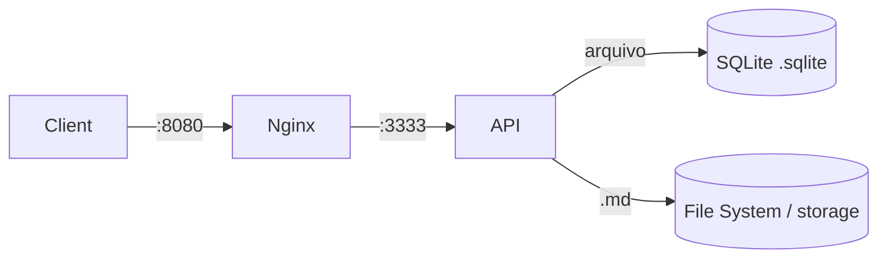

# 🚀 CodeHub

O **CodeHub** é um sistema centralizado e um inventário inteligente para armazenamento, categorização e recuperação rápida de artefatos de código. Ele foi projetado para evitar o retrabalho na construção de infraestrutura base, armazenando *snippets* reutilizáveis, arquivos de configuração (Docker, Nginx, CI/CD), middlewares e scripts utilitários.

## 🏗️ Arquitetura e Stack Tecnológica

O projeto foi construído sob uma arquitetura de **Monorepo** e utiliza uma abordagem de **Armazenamento Híbrido**:

- **Indexação e Taxonomia:** **SQLite** — o arquivo `.sqlite` é o "Memory Card" do sistema e é **versionado no Git** (save state via commit).
- **Armazenamento de Conteúdo:** File System local, com arquivos Markdown (`.md`) usando Frontmatter para metadados e suporte a diagramas Mermaid.

**Stack Principal:**

- **Backend:** Node.js, TypeScript, Express.js (arquitetura limpa: Routes → Controllers → Services → Repositories).
- **Validação:** Zod. **Testes:** Jest (TDD estrito na camada de Services; repos por integração `:memory:`).
- **Banco de Dados:** **SQLite** (driver `better-sqlite3`).
- **Frontend:** React + Vite + Tailwind; **Modo Jogo** opcional em React Three Fiber + GSAP.
- **Infraestrutura:** Docker, Nginx, GitHub Actions (CI).

> 🆕 **v2.0:** SQLite versionável, 16 tipos de artefato, 53 conquistas, Markdown nativo,
> 3 temas novos (Dracula/Monokai/Cyberpunk 2077) e o **Modo Jogo** (quarto 2D pixel art,
> avatar estilo Link, WASD). Veja `docs/v2-roadmap.md`.

## 📂 Estrutura do Monorepo (Workspaces)

```text
codehub/
├── docs/                 # Documentação base (PDD, SDD, TDD, ROADMAP)
├── app/
│   ├── api/              # Backend (Node.js + Express) — inclui o Dockerfile
│   └── web/              # Frontend (React + Vite + TypeScript + Tailwind)
├── infra/
│   └── nginx/            # Configuração do proxy reverso (Nginx)
├── .github/workflows/    # Pipeline de CI (lint + test + build)
├── docker-compose.yml    # Orquestra API + Nginx (SQLite é arquivo local)
└── claude.md             # Diretrizes arquiteturais e regras de IA
```

## 🐳 Como rodar (Docker — recomendado)

Sobe a stack — **API + Nginx** (o SQLite é um arquivo local, sem container de banco). Na primeira vez, o app pede seu **codinome** para criar o "Memory Card" (`<nome>.sqlite`).

> **Pré-requisito:** Docker + Docker Compose instalados.

```bash
# 1. Builda as imagens
docker compose build

# 2. Sobe os serviços em segundo plano (-d = detached)
docker compose up -d
```

A API fica acessível, através do Nginx, em **http://localhost:8080**.

**Verifique se subiu:**

```bash
curl http://localhost:8080/health
# {"status":"ok","service":"codehub-api"}
```

**Endpoints disponíveis:**

| Recurso | Rota base |
| --- | --- |
| Setup (1ª execução) | `/api/setup` |
| Snippets | `/api/snippets` |
| Tipos de projeto | `/api/types` |
| Tags | `/api/tags` |
| Perfil (XP/conquistas) | `/api/profile` |
| Inventário (pastas) | `/api/folders` |
| Eventos de gamificação (SSE) | `/api/events` |

**Operação:**

```bash
docker compose ps          # status dos containers
docker compose logs -f api # acompanha os logs da API
docker compose down        # para tudo (o .sqlite e os .md ficam em app/api/storage)
```

**Variáveis de ambiente (opcionais):**

| Variável | Default | |
| --- | --- | --- |
| `STORAGE_PATH` | `./storage` | onde ficam o `.sqlite` e os `.md` — o "save state" versionado no Git |

> Apenas o Nginx (`8080`) precisa estar livre no host; não há mais banco em container.
> O `app/api/storage` é um bind mount, então seus dados sobrevivem a `docker compose down`.

### Fluxo da stack



## 🧪 Desenvolvimento local (sem Docker)

Requer Node.js 20+. As dependências são gerenciadas via **npm workspaces**.

```bash
# 1. Instala as dependências (na raiz)
npm install

# 2. Roda os testes em watch (ciclo de TDD)
npm test            # roda toda a suíte uma vez
npm run lint        # ESLint
npm run build       # compila o TypeScript

# Para iterar em TDD na API:
npm run test:watch -w @codehub/api
```

> Na primeira execução, o app exibe a tela de setup (_"identify yourself"_) para criar a conta/banco `.sqlite`. Não há credenciais de banco a configurar.

### Frontend (`app/web`)

SPA em React + Vite + Tailwind. Em dev, o Vite faz **proxy** de `/api` para a stack do backend (Nginx em `:8080`), então **suba o backend primeiro** (`docker compose up -d`) e depois:

```bash
npm run dev -w @codehub/web      # http://localhost:5173
npm run build -w @codehub/web    # build de produção (tsc + vite)
```

A interface tem abas para **Perfil** (XP/patente/conquistas), **Snippets**, **Inventário**
(pastas), **Tipos**, **Tags**, **Ajuda** e **Config** — e o **Modo Jogo** (hub 2D pixel art).

## 📖 Documentação e Metodologia

O desenvolvimento é guiado por quatro documentos em `docs/`:

- **PDD** — jornadas de valor e casos de uso do produto.
- **SDD** — planta técnica: esquema do banco, contratos da API (REST) e estrutura.
- **TDD** — estratégia de testes obrigatória (Red → Green → Refactor).
- **ROADMAP** — plano de execução e rastreador de progresso (fases 0–7).

> 🤖 **Nota para IAs e Assistentes de Código:** antes de qualquer alteração estrutural, é obrigatório ler o `claude.md` na raiz — ele contém as diretrizes inegociáveis de tipagem, estrutura de pastas e fluxo de testes.

---

Desenvolvido com foco em padronização, segurança (DevSecOps) e arquitetura limpa.
