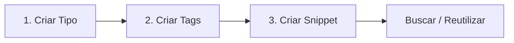
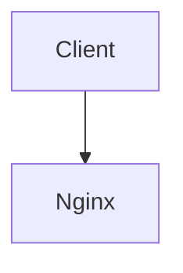

# 🚀 Guia de Uso — CodeHub

O **CodeHub** é o seu inventário de snippets e configurações reutilizáveis
(middlewares, `Dockerfile`, `docker-compose`, configs de Nginx, scripts, etc.).
Cada item é organizado por **tipo de projeto** e **tags**, com os metadados no
MySQL e o conteúdo salvo como arquivo `.md` (Frontmatter + Mermaid).

---

## 1. Subindo o ambiente

Pré-requisito: **Docker + Docker Compose**.

```bash
# Backend (API + MySQL + Nginx) — a migration é aplicada automaticamente
docker compose up -d

# Frontend (interface DedSec)
npm install
npm run dev -w @codehub/web
```

- **Interface:** http://localhost:5173
- **API (via Nginx):** http://localhost:8080
- Healthcheck: `curl http://localhost:8080/health` → `{"status":"ok",...}`

> Conflito na porta 3306? Você tem um MySQL local. A stack já publica o MySQL
> na **3307** por padrão (`DB_HOST_PORT` para customizar).

---

## 2. A interface

A barra lateral tem 5 abas:

| Aba | Para quê |
| --- | --- |
| **Snippets** | criar, buscar e remover snippets |
| **Tipos** | gerenciar tipos de projeto (taxonomia) |
| **Tags** | gerenciar tags |
| **Ajuda** | este guia, resumido, dentro do app |
| **Config** | tema, animações e (futuramente) conta |

---

## 3. Fluxo recomendado (passo a passo)



### Passo 1 — Crie um Tipo

Aba **Tipos** → digite um nome → **Add**. Exemplos:

- `DevSecOps`
- `Node.js`
- `Frontend`

### Passo 2 — Crie Tags

Aba **Tags** → adicione rótulos. Exemplos:

- `docker`, `nginx`, `security`, `middleware`

### Passo 3 — Crie um Snippet

Aba **Snippets**, no formulário à esquerda:

1. **Título** — ex.: `Nginx Security Headers`
2. **Descrição** (opcional) — ex.: `Headers recomendados pela OWASP`
3. **Tipo** — selecione `DevSecOps`
4. **Conteúdo** — o código/config (veja exemplo abaixo)
5. **Tags** — clique para marcar `nginx`, `security`
6. **Mermaid** (opcional) — um diagrama de fluxo
7. **Salvar snippet**

---

## 4. Exemplos prontos

### Exemplo A — Nginx Security Headers (tipo `DevSecOps`)

```nginx
# --- Cabeçalhos de Segurança (OWASP) ---
add_header X-Frame-Options "SAMEORIGIN" always;
add_header X-Content-Type-Options "nosniff" always;
add_header Content-Security-Policy "default-src 'self'; upgrade-insecure-requests;" always;
add_header Strict-Transport-Security "max-age=31536000; includeSubDomains; preload" always;
add_header Referrer-Policy "strict-origin-when-cross-origin" always;
```

### Exemplo B — Dockerfile Node (tipo `Node.js`, tag `docker`)

```dockerfile
FROM node:20-alpine
WORKDIR /app
COPY package*.json ./
RUN npm ci --omit=dev
COPY . .
EXPOSE 3000
CMD ["node", "dist/server.js"]
```

### Exemplo C — Fluxo Mermaid (campo "Fluxo Mermaid")

```text
graph TD
  Client --> Nginx
  Nginx --> API
  API --> MySQL
```

O resultado é um `.md` físico como:

```markdown
---
id: 1
title: "Nginx Security Headers"
type: "DevSecOps"
tags: ["nginx", "security"]
created_at: "2026-05-31"
---

add_header X-Frame-Options "SAMEORIGIN" always;
...


```

---

## 5. Buscar e reutilizar

Na aba **Snippets**, use o campo de busca (filtra por título/descrição — tecle
**Enter**). Cada card mostra o **tipo** e a data. Para remover, passe o mouse e
clique no ícone de lixeira.

---

## 6. Temas e preferências (aba Config)

- **Tema:** `DedSec` (neon dark, padrão), `Midnight` (dark sóbrio) ou `Light`.
- **Animações:** liga/desliga o boot, transições e o efeito glitch.
- **Scanlines:** efeito CRT sobre a tela.
- **Conta:** *em breve* — login e sincronização entre dispositivos.

As preferências ficam salvas no navegador (localStorage).

---

## 7. Usando a API direto (power users)

Tudo na UI também está disponível via REST (base: `http://localhost:8080`).

```bash
# Criar um tipo
curl -X POST http://localhost:8080/api/types \
  -H "Content-Type: application/json" \
  -d '{"name":"DevSecOps"}'

# Criar uma tag
curl -X POST http://localhost:8080/api/tags \
  -H "Content-Type: application/json" \
  -d '{"name":"nginx"}'

# Criar um snippet (use os ids retornados acima)
curl -X POST http://localhost:8080/api/snippets \
  -H "Content-Type: application/json" \
  -d '{
    "title": "Nginx Security Headers",
    "description": "Headers OWASP",
    "content": "add_header X-Frame-Options \"SAMEORIGIN\" always;",
    "type_id": 1,
    "tags": [1],
    "mermaid_flow": "graph TD\nClient --> Nginx"
  }'

# Listar / filtrar
curl "http://localhost:8080/api/snippets?search=nginx"
```

| Método | Rota | Descrição |
| --- | --- | --- |
| `GET` | `/api/snippets` | lista (filtros: `typeId`, `tagId`, `search`) |
| `GET` | `/api/snippets/:id` | detalhe (metadados + conteúdo do `.md`) |
| `POST` | `/api/snippets` | cria |
| `PUT` | `/api/snippets/:id` | atualiza |
| `DELETE` | `/api/snippets/:id` | remove |
| `*` | `/api/types`, `/api/tags` | CRUD da taxonomia |

---

## 8. Problemas comuns

| Sintoma | Causa provável | Solução |
| --- | --- | --- |
| `bind: ...3306... in use` | MySQL local na 3306 | já usamos 3307; ou `DB_HOST_PORT=3399 docker compose up -d` |
| UI carrega mas listas vazias / erro | backend fora do ar | `docker compose up -d` e veja `Config → Status` |
| `lookup registry-1.docker.io` no build | DNS do Docker | reinicie o Docker Desktop / cheque VPN; não use `--no-cache` |

Bons hacks. // stay anonymous
