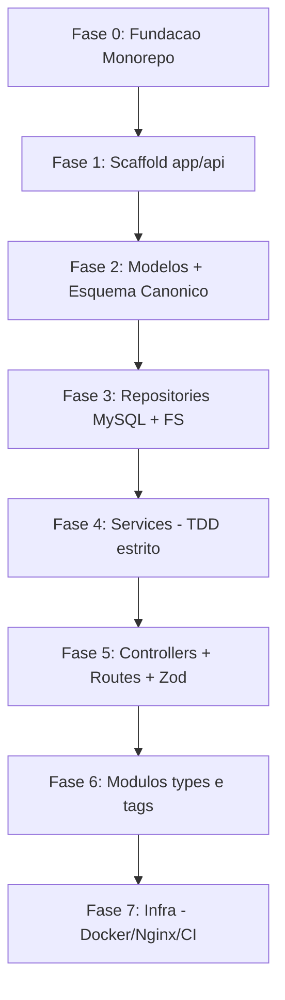

# ROADMAP - CodeHub

> **Propósito deste arquivo:** servir como fonte única de progresso. Se a sessão
> for interrompida (tokens acabarem), basta reabrir este arquivo e ler a seção
> [Como retomar](#como-retomar) para continuar exatamente de onde paramos.

## Decisões de Arquitetura (travadas em 2026-05-30)

| Tema | Decisão | Implicação |
| --- | --- | --- |
| Acesso ao MySQL | **mysql2 (SQL puro)** | Repositories escrevem SQL direto; migrations à mão. Honra o "interface direta com o banco" do `claude.md`. |
| Estratégia de ID | **Auto Increment (INT)** | `id` só existe após o `INSERT`. Ver regra do fluxo de criação abaixo. |
| Validação de entrada | **Zod** | Schemas nos Controllers; tipos inferidos do schema (sem `any`). |
| Monorepo | **npm workspaces** | `package.json` raiz com `workspaces: ["app/*"]`. Sem ferramenta extra. |

### Regra do fluxo de criação de snippet (consequência do Auto Increment)

1. Validar entrada (Zod, no Controller).
2. `INSERT` dos metadados no MySQL → obter o `id` gerado.
3. Gravar o arquivo físico `storage/<id>.md` (Frontmatter + corpo + Mermaid).
4. `UPDATE` da coluna `file_path` no MySQL com o caminho final.
5. Operação transacional: se a escrita do arquivo falhar, desfazer o registro no banco.

## Esquema Canônico do Banco (corrige a §3 do SDD.md)

> O `SDD.md` §3 está com as tabelas `snippets`/`snippet_tags` duplicadas e com
> colunas embaralhadas. Esta é a versão canônica a ser usada na migration.

```sql
-- project_types
id          INT PRIMARY KEY AUTO_INCREMENT
name        VARCHAR(120) NOT NULL UNIQUE      -- "Node.js", "DevSecOps", "Frontend"

-- tags
id          INT PRIMARY KEY AUTO_INCREMENT
name        VARCHAR(120) NOT NULL UNIQUE      -- "middleware", "docker", "nginx"

-- snippets
id          INT PRIMARY KEY AUTO_INCREMENT
title       VARCHAR(255) NOT NULL
description  TEXT
file_path   VARCHAR(512) NOT NULL             -- caminho para o .md em storage/
type_id     INT NOT NULL                      -- FK -> project_types.id
created_at  TIMESTAMP DEFAULT CURRENT_TIMESTAMP

-- snippet_tags (pivô N:M)
snippet_id  INT NOT NULL                      -- FK -> snippets.id
tag_id      INT NOT NULL                      -- FK -> tags.id
PRIMARY KEY (snippet_id, tag_id)
```

## Mapa de Dependências das Fases



## Checklist de Progresso

### Fase 0 — Fundação do Monorepo ✅ (2026-05-30)
- [x] `package.json` raiz com `workspaces: ["app/*"]`
- [x] `.gitignore` (expandido), `.eslintrc.json`, `.eslintignore`, `.prettierrc` globais
- [x] `tsconfig.base.json` na raiz
- [x] Repositório git já existia (origin: github.com/rafafrd/CodeHub) — `git init` desnecessário

### Fase 1 — Scaffold `app/api/` ✅ (2026-05-30)
- [x] `app/api/package.json` (deps: `express`, `mysql2`, `zod`, `gray-matter`; dev: `typescript`, `jest`, `ts-jest`, `@types/*`, `supertest`)
- [x] `app/api/tsconfig.json` + `jest.config.ts` (scripts `test`, `test:watch`, `test:coverage`)
- [x] Estrutura de pastas `src/modules/{snippets,types,tags}` + `src/shared/{http,errors}` (com `.gitkeep`)
- [x] `shared/errors/app-error.ts` (+ `.spec.ts`) — classe de erro de domínio
- [x] `shared/http/app.ts` (app testável) + `server.ts` + `routes.ts` (`/health`) + smoke test
- [x] Verificado: `npm test` (3 ok) + `npm run build` + `npm run lint` passando

### Fase 2 — Modelos de Domínio + Esquema Canônico ✅ (2026-05-30)
- [x] `modules/snippets/models/snippet.ts` (+ `types/models/project-type.ts`, `tags/models/tag.ts`)
- [x] Migration SQL com o esquema canônico → `app/api/src/database/migrations/001_initial_schema.sql` (+ README)
- [x] `SDD.md` §3 e §5 corrigidas + Frontmatter adicionado

### Fase 3 — Repositories ✅ (2026-05-30)
- [x] `repositories/file-system-repository.ts` + `.spec.ts` (gera/lê/apaga `.md` via gray-matter; fs mockado)
- [x] `repositories/snippet-repository.ts` + `.spec.ts` (mysql2: create/updateFilePath/attachTags/findById/list/delete)
- [x] Interfaces `FileSystemRepository` e `SnippetRepository` (para mock nos Services na Fase 4)
- [x] `database/connection.ts` (pool mysql2) + `Snippet.filePath` agora `string | null`

### Fase 4 — Services (TDD estrito — coração do projeto) ✅ (2026-05-30)
- [x] **`create-snippet-service`** ✅ (RED→GREEN, 6 testes): valida regra, resolve type/tags (id→nome), INSERT, grava `.md`, update path, attach tags, compensação em falha. Deps de leitura criadas: `ProjectTypeRepository.findById` e `TagRepository.findByIds`.
- [x] `list-snippets-service` (filtros type/tag/search; normaliza busca) — CU02 ✅
- [x] `get-snippet-service` (lê o `.md` via `FileSystemRepository.read`; 404 se ausente) — CU03 ✅
- [x] `update-snippet-service` (reescreve metadados + `.md`; preserva `created_at`; `replaceTags`) ✅
- [x] `delete-snippet-service` (apaga arquivo + registro; pivô em cascata) ✅
- [x] `SnippetRepository` estendido: `update` + `replaceTags` (com specs)

### Fase 5 — Controllers + Routes + Validação ✅ (2026-05-30)
- [x] Schemas Zod (`snippet-schemas.ts`): body snake_case (SDD §5) → input camelCase; query e `:id`
- [x] `SnippetController` (5 ações) + `snippet-routes.ts` (injeção do controller) + `snippet-module.ts` (composição)
- [x] Rotas plugadas em `shared/http/routes.ts` (`/api/snippets`); `errorHandler` central + `asyncHandler`
- [x] Testes de integração (supertest): 201/400/200/404/204 — Services mockados
- [x] `.eslintrc`: `no-unused-vars` com `argsIgnorePattern: ^_` (error handler do Express tem 4 args)

### Fase 6 — Módulos `types` e `tags` ✅ (2026-05-30)
- [x] CRUD de `project_types`: repo estendido + 4 services (TDD) + controller/rotas/Zod + integração → `/api/types`
- [x] CRUD de `tags`: repo estendido + 4 services (TDD) + controller/rotas/Zod + integração → `/api/tags`
- [x] Unicidade de nome validada nos services (409); rotas plugadas em `shared/http/routes.ts`

### Fase 7 — Infraestrutura ✅ (2026-05-30)
- [x] `app/api/Dockerfile` (multi-stage) + `.dockerignore` — **imagem validada (build + boot + /health)**
- [x] `infra/docker-compose.yml` (api + mysql + nginx; migration `001` auto-aplicada via initdb)
- [x] `infra/nginx/default.conf` (proxy reverso + headers de segurança OWASP do SDD)
- [x] `.github/workflows/ci.yml` (lint + test + build) + `infra/README.md`

## Mapeamento Casos de Uso (PDD) → Fases
- **CU01** (Cadastrar snippet): Fases 3, 4, 5
- **CU02** (Buscar por tipo/tag): Fase 4 (`list`) + 5
- **CU03** (Visualizar com Mermaid): Fase 4 (`get`) + 5 (frontend renderiza)

## Como retomar
1. Abra este arquivo e veja o **primeiro item não marcado** no Checklist.
2. Confirme que as **Decisões de Arquitetura** acima ainda valem.
3. Se for um Service, lembre do **TDD estrito**: escreva o `.spec.ts` primeiro (RED).
4. Use o **Esquema Canônico** desta página como fonte da verdade (não o §3 do SDD).
5. Ao concluir um item, **marque o checkbox** e atualize `updated_at` no Frontmatter.

## Log de Decisões e Pendências
- **2026-05-30:** Definidas as 4 decisões de arquitetura (mysql2 / Auto Increment / Zod / npm workspaces).
- **2026-05-30:** Fases 0 e 1 concluídas na branch `feature/fase-0-1-fundacao-e-scaffold-api` e mergeadas na `dev`.
- **2026-05-30:** Fase 2 concluída na branch `feature/fase-2-modelos-e-schema`: modelos de domínio, migration `001` e correção do `SDD.md` (§3/§5). ✅ Pendência da §3/§5 resolvida.
- **2026-05-30:** ✅ Pendência nome-vs-id RESOLVIDA na Fase 4: o contrato de entrada do `CreateSnippetService` usa **IDs** (`typeId`/`tagIds`, conforme `SDD.md` §5). O Service resolve os **nomes** internamente (via `ProjectTypeRepository`/`TagRepository`) para gravar o Frontmatter legível (`SDD.md` §4). O exemplo do `TDD.md` com nomes era ilustrativo.
- **2026-05-30:** Review do Copilot no PR da Fase 2 — aplicados 4 ajustes (aprovados): `file_path` agora `NULL` (compatível com o fluxo insert→arquivo→update); SDD §5 `GET/:id` corrige violação de camadas (FS no Service/Repo, não no Controller); IDs padronizados para `INT UNSIGNED AUTO_INCREMENT` no SDD; exemplo de Frontmatter (§4) com `id` inteiro (não UUID).
- **2026-05-30:** Fase 3 (repositories) mergeada na `dev` (PR #3).
- **2026-05-30:** Fase 4 COMPLETA — 5 services (create/list/get/update/delete) via TDD, 36 testes verdes. Repo estendido com `update`/`replaceTags`.
- **2026-05-30:** Fase 4 mergeada na `dev` (PR #4).
- **2026-05-30:** Fase 5 COMPLETA — camada HTTP de snippets (controller + rotas + Zod + error handler), 42 testes verdes (6 de integração). API responde de ponta a ponta em `/api/snippets`.
- **Decisão Fase 5:** filtros de listagem por **id** (`?typeId=&tagId=&search=`), consistente com o contrato id-based. O exemplo do SDD §5 com nomes (`?type=devsecops`) fica para a Fase 6 (quando houver lookup de tipo/tag por nome).
- **2026-05-30:** Fase 5 mergeada na `dev` (PR #5).
- **2026-05-30:** Fase 6 COMPLETA — CRUD de `types` e `tags` (8 services via TDD + controllers/rotas/Zod + integração). Total: 71 testes verdes. API expõe `/api/snippets`, `/api/types`, `/api/tags`.
- **2026-05-30:** Fase 6 mergeada na `dev` (PR #6).
- **2026-05-30:** Fase 7 COMPLETA — Dockerfile multi-stage (imagem validada: build + boot + `/health` ok), docker-compose (api+mysql+nginx, migration auto), Nginx com headers OWASP, CI. **MVP do backend concluído (Fases 0–7).**
- **Backlog (melhorias futuras):** `DELETE /api/types/:id` em uso → mapear FK RESTRICT para 409; filtro de listagem por nome (SDD §5 `?type=devsecops`); testes de integração com banco real; HTTPS/TLS no Nginx; frontend (`app/web`).
