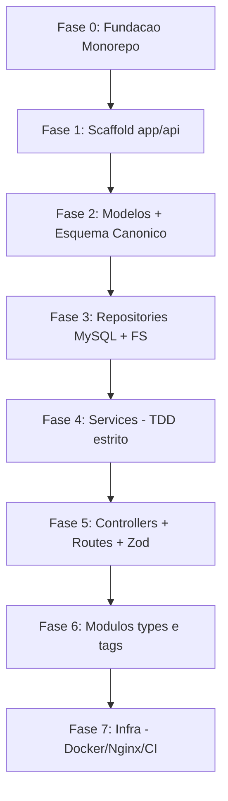

# ROADMAP - CodeHub

> **Propósito deste arquivo:** servir como fonte única de progresso. Se a sessão
> for interrompida (tokens acabarem), basta reabrir este arquivo e ler a seção
> [Como retomar](#como-retomar) para continuar exatamente de onde paramos.

## Decisões de Arquitetura (travadas em 2026-05-30)

| Tema | Decisão | Implicação |
| --- | --- | --- |
| Acesso ao MySQL | **mysql2 (SQL puro)** | Repositories escrevem SQL direto; migrations à mão. Honra o "interface direta com o banco" do `claude.md`. |
| Estratégia de ID | **Auto Increment (INT)** | `id` só existe após o `INSERT`. Ver regra do fluxo de criação abaixo. |
| Validação de entrada | **Zod** | Schemas nos Controllers; tipos inferidos do schema (sem `any`). |
| Monorepo | **npm workspaces** | `package.json` raiz com `workspaces: ["app/*"]`. Sem ferramenta extra. |

### Regra do fluxo de criação de snippet (consequência do Auto Increment)

1. Validar entrada (Zod, no Controller).
2. `INSERT` dos metadados no MySQL → obter o `id` gerado.
3. Gravar o arquivo físico `storage/<id>.md` (Frontmatter + corpo + Mermaid).
4. `UPDATE` da coluna `file_path` no MySQL com o caminho final.
5. Operação transacional: se a escrita do arquivo falhar, desfazer o registro no banco.

## Esquema Canônico do Banco (corrige a §3 do SDD.md)

> O `SDD.md` §3 está com as tabelas `snippets`/`snippet_tags` duplicadas e com
> colunas embaralhadas. Esta é a versão canônica a ser usada na migration.

```sql
-- project_types
id          INT PRIMARY KEY AUTO_INCREMENT
name        VARCHAR(120) NOT NULL UNIQUE      -- "Node.js", "DevSecOps", "Frontend"

-- tags
id          INT PRIMARY KEY AUTO_INCREMENT
name        VARCHAR(120) NOT NULL UNIQUE      -- "middleware", "docker", "nginx"

-- snippets
id          INT PRIMARY KEY AUTO_INCREMENT
title       VARCHAR(255) NOT NULL
description  TEXT
file_path   VARCHAR(512) NOT NULL             -- caminho para o .md em storage/
type_id     INT NOT NULL                      -- FK -> project_types.id
created_at  TIMESTAMP DEFAULT CURRENT_TIMESTAMP

-- snippet_tags (pivô N:M)
snippet_id  INT NOT NULL                      -- FK -> snippets.id
tag_id      INT NOT NULL                      -- FK -> tags.id
PRIMARY KEY (snippet_id, tag_id)
```

## Mapa de Dependências das Fases



## Checklist de Progresso

### Fase 0 — Fundação do Monorepo ✅ (2026-05-30)
- [x] `package.json` raiz com `workspaces: ["app/*"]`
- [x] `.gitignore` (expandido), `.eslintrc.json`, `.eslintignore`, `.prettierrc` globais
- [x] `tsconfig.base.json` na raiz
- [x] Repositório git já existia (origin: github.com/rafafrd/CodeHub) — `git init` desnecessário

### Fase 1 — Scaffold `app/api/` ✅ (2026-05-30)
- [x] `app/api/package.json` (deps: `express`, `mysql2`, `zod`, `gray-matter`; dev: `typescript`, `jest`, `ts-jest`, `@types/*`, `supertest`)
- [x] `app/api/tsconfig.json` + `jest.config.ts` (scripts `test`, `test:watch`, `test:coverage`)
- [x] Estrutura de pastas `src/modules/{snippets,types,tags}` + `src/shared/{http,errors}` (com `.gitkeep`)
- [x] `shared/errors/app-error.ts` (+ `.spec.ts`) — classe de erro de domínio
- [x] `shared/http/app.ts` (app testável) + `server.ts` + `routes.ts` (`/health`) + smoke test
- [x] Verificado: `npm test` (3 ok) + `npm run build` + `npm run lint` passando

### Fase 2 — Modelos de Domínio + Esquema Canônico ✅ (2026-05-30)
- [x] `modules/snippets/models/snippet.ts` (+ `types/models/project-type.ts`, `tags/models/tag.ts`)
- [x] Migration SQL com o esquema canônico → `app/api/src/database/migrations/001_initial_schema.sql` (+ README)
- [x] `SDD.md` §3 e §5 corrigidas + Frontmatter adicionado

### Fase 3 — Repositories
- [ ] `repositories/file-system-repository.ts` (gera/lê/atualiza/apaga `.md` via gray-matter)
- [ ] `repositories/snippet-repository.ts` (mysql2: insert/select/update/delete + pivô de tags)
- [ ] Interfaces dos repositories (para mock nos Services)

### Fase 4 — Services (TDD estrito — coração do projeto)
- [ ] **`create-snippet-service.spec.ts` (RED) → `create-snippet-service.ts` (GREEN) → REFACTOR**  ⭐ primeiro alvo de TDD
- [ ] `list-snippets-service` (filtros: type, tag, search) — CU02
- [ ] `get-snippet-service` (lê o `.md` físico) — CU03
- [ ] `update-snippet-service`
- [ ] `delete-snippet-service`

### Fase 5 — Controllers + Routes + Validação
- [ ] Schemas Zod de entrada
- [ ] `create-snippet-controller.ts` + `snippet-routes.ts`
- [ ] Plugar rotas no `shared/http/routes.ts`
- [ ] Testes de integração (supertest): 200/201/400/404

### Fase 6 — Módulos `types` e `tags`
- [ ] CRUD de `project_types`
- [ ] CRUD de `tags`

### Fase 7 — Infraestrutura
- [ ] `infra/` Dockerfile (api) + `docker-compose.yml` (api + mysql)
- [ ] `infra/` config Nginx (proxy reverso + headers de segurança do SDD)
- [ ] `.github/workflows/` (lint + test no CI)

## Mapeamento Casos de Uso (PDD) → Fases
- **CU01** (Cadastrar snippet): Fases 3, 4, 5
- **CU02** (Buscar por tipo/tag): Fase 4 (`list`) + 5
- **CU03** (Visualizar com Mermaid): Fase 4 (`get`) + 5 (frontend renderiza)

## Como retomar
1. Abra este arquivo e veja o **primeiro item não marcado** no Checklist.
2. Confirme que as **Decisões de Arquitetura** acima ainda valem.
3. Se for um Service, lembre do **TDD estrito**: escreva o `.spec.ts` primeiro (RED).
4. Use o **Esquema Canônico** desta página como fonte da verdade (não o §3 do SDD).
5. Ao concluir um item, **marque o checkbox** e atualize `updated_at` no Frontmatter.

## Log de Decisões e Pendências
- **2026-05-30:** Definidas as 4 decisões de arquitetura (mysql2 / Auto Increment / Zod / npm workspaces).
- **2026-05-30:** Fases 0 e 1 concluídas na branch `feature/fase-0-1-fundacao-e-scaffold-api` e mergeadas na `dev`.
- **2026-05-30:** Fase 2 concluída na branch `feature/fase-2-modelos-e-schema`: modelos de domínio, migration `001` e correção do `SDD.md` (§3/§5). ✅ Pendência da §3/§5 resolvida.
- **Pendência (resolver na Fase 4):** o exemplo do `TDD.md` usa `type` e `tags` por **nome** (string), enquanto o `SDD.md` §5 usa **ids** (`type_id`, `tags: [1,5,8]`). Definir o contrato de entrada do `CreateSnippetService` ao escrever o teste (RED).
- **Próximo:** Fase 3 (repositories `SnippetRepository`/mysql2 + `FileSystemRepository`/gray-matter), depois Fase 4 (TDD do `CreateSnippetService`).
