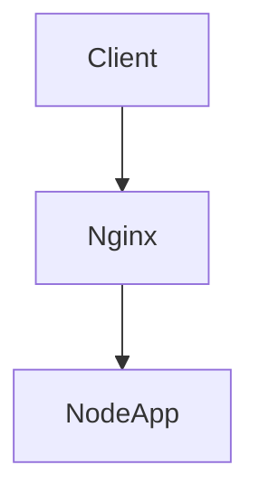

# SDD - CodeHub (Spec Driven Development)

## 1. Visão Arquitetural

O CodeHub funcionará com uma arquitetura híbrida de armazenamento:

- **Metadados e Buscas (MySQL):** Armazena relacionamentos, categorias e caminhos dos arquivos para permitir buscas otimizadas e relacionais.
- **Armazenamento de Conteúdo (File System):** Os códigos em si serão salvos em arquivos `.md` físicos, contendo metadados (Frontmatter) no topo e o conteúdo estruturado abaixo (incluindo diagramas Mermaid).

O backend será construído em **Node.js + Express** utilizando **TypeScript** e seguirá um padrão modular.

## 2. Estrutura de Diretórios (Padrão Modular)

A estrutura garantirá a separação de responsabilidades, facilitando a aplicação de testes (TDD) e a escalabilidade.

```text
codehub/
├── .github/
│   └── workflows/               # Pipelines de CI/CD (ex: build.yml, deploy.yml)
├── app/
│   ├── api/                     # Seu backend original
│   │   ├── src/
│   │   │   ├── modules/
│   │   │   │   ├── snippets/
│   │   │   │   │   ├── controllers/
│   │   │   │   │   │   └── create-snippet-controller.ts
│   │   │   │   │   ├── services/
│   │   │   │   │   │   ├── create-snippet-service.ts
│   │   │   │   │   │   └── create-snippet-service.spec.ts
│   │   │   │   │   ├── repositories/
│   │   │   │   │   │   ├── snippet-repository.ts
│   │   │   │   │   │   └── file-system-repository.ts
│   │   │   │   │   ├── models/
│   │   │   │   │   │   └── snippet.ts
│   │   │   │   │   └── routes/
│   │   │   │   │       └── snippet-routes.ts
│   │   │   │   ├── types/       # Módulo para os Tipos de Projeto
│   │   │   │   └── tags/        # Módulo para Gerenciamento de Tags
│   │   │   ├── shared/
│   │   │   │   ├── http/
│   │   │   │   │   ├── server.ts
│   │   │   │   │   └── routes.ts
│   │   │   │   └── errors/
│   │   │   └── storage/
│   │   ├── package.json         # Dependências específicas da API
│   │   ├── tsconfig.json
│   │   └── jest.config.ts
│   └── web/                     # Novo frontend
│       ├── public/
│       │   └── assets/
│       │       └── img/         # Imagens estáticas e SVGs do front
│       ├── src/                 # Componentes, páginas, hooks e estilos do frontend
│       ├── package.json         # Dependências específicas do Web
│       └── tsconfig.json
├── infra/                       # Arquivos de infraestrutura (Docker, Terraform, Nginx, etc.)
├── .eslintrc.json               # Configuração do Lint (Global)
├── .eslintignore                # Pastas e arquivos ignorados pelo Lint
├── .prettierrc                  # Configuração de formatação de código (Global)
├── package.json                 # Package root (Configuração de Workspaces)
└── claude.md                    # Arquivo de contexto de IA
```

3. Esquema de Banco de Dados (MySQL)
   As tabelas principais focarão na taxonomia para facilitar as consultas.

- project_types:
  - `id` (PK, UUID ou Auto Increment)
  - `name` (ex: "Node.js", "DevSecOps", "Frontend")

- tags:
  - `id` (PK)
  - `name` (ex: "middleware", "docker", "nginx", "security")

- snippets:
- **snippets**:
  - `id` (PK, UUID ou Auto Increment)
  - `title` (VARCHAR)
  - `description` (TEXT)
  - `file_path` (VARCHAR - Caminho para o arquivo .md no File System)
  - `type_id` (FK -> project_types.id)
  - `created_at` (TIMESTAMP)

- **snippet_tags** (Tabela pivô N:M):
  - `snippet_id` (FK -> snippets.id)
  - `tag_id` (FK -> tags.id)

- snippet_tags (Tabela pivô N:M):
  - `snippet_id` (FK -> snippets.id)
  - `tag_id` (FK -> tags.id)
  - `id` (PK)
  - `title` (VARCHAR)
  - `description` (TEXT)
  - `file_path` (VARCHAR - Caminho para o arquivo .md no File System)
  - `type_id` (FK -> project_types.id)
  - `created_at` (TIMESTAMP)
  - `snippet_tags` (Tabela pivô N:M):
  - `snippet_id` (FK -> snippets.id)
  - `tag_id` (FK -> tags.id)

---

## 4. Estrutura do Arquivo Markdown (.md)

Quando um snippet for salvo, o sistema gerará um arquivo físico na pasta storage/ com o seguinte padrão (exemplo para um arquivo de configuração de segurança):

```Markdown
---
id: "123e4567-e89b-12d3-a456-426614174000"
title: "Nginx Security Headers Default"
type: "DevSecOps"
tags: ["nginx", "security", "hardening"]
created_at: "2026-05-30"
---
```

# Configuração Padrão de Segurança para Nginx

Este snippet adiciona os headers recomendados pela OWASP.

```nginx
# --- Ocultação ---
server_tokens off;
proxy_hide_header X-Powered-By;
fastcgi_hide_header X-Powered-By;

# --- Cabeçalhos de Segurança ---
add_header X-Frame-Options "SAMEORIGIN" always;
add_header X-Content-Type-Options "nosniff" always;
add_header Content-Security-Policy "default-src 'self'; upgrade-insecure-requests;" always;
add_header Strict-Transport-Security "max-age=31536000; includeSubDomains; preload" always;
add_header Referrer-Policy "strict-origin-when-cross-origin" always;
add_header Permissions-Policy "geolocation=(), microphone=(), camera=()" always;

# Nota sobre o X-XSS-Protection:
# Ele foi descontinuado pelos navegadores modernos por causar mais problemas do que resolver.
# Hoje em dia, a Content-Security-Policy (CSP) é quem cuida disso. Você pode mantê-lo para navegadores muito antigos, mas não é mais necessário:
# add_header X-XSS-Protection "1; mode=block" always;
```

Arquitetura de Redirecionamento
Snippet de código



_(Nota: O parser do Node.js lerá o bloco `---` no topo para sincronizar com o MySQL)._

## 5. Contratos da API (Endpoints REST)

### `POST /api/snippets`

- **Descrição:** Cria um novo snippet, salva o arquivo `.md` no disco e registra no MySQL.
- **Body:**

```json
  {
    "title": "Nginx Security Headers Default",
    "description": "Headers de segurança básicos",
    "content": "add_header X-Frame-Options...",
    "type_id": 2,
    "tags": [1, 5, 8],
    "mermaid_flow": "graph TD\nClient --> Nginx..."
  }
GET /api/snippets
Descrição: Lista snippets com paginação e filtros.

Query Params: ?type=devsecops, ?tag=nginx, ?search=headers

Response: Retorna array de objetos com os metadados.

GET /api/snippets/:id
Descrição: Retorna os detalhes de um snippet específico. O Controller deverá ler o arquivo .md físico através do ID e retornar o conteúdo completo (Frontmatter + Corpo) para ser renderizado no Frontend.

PUT /api/snippets/:id
Descrição: Atualiza metadados no banco e reescreve o arquivo .md.

DELETE /api/snippets/:id
Descrição: Remove o registro do banco de dados e apaga o arquivo físico da pasta storage/.
```
