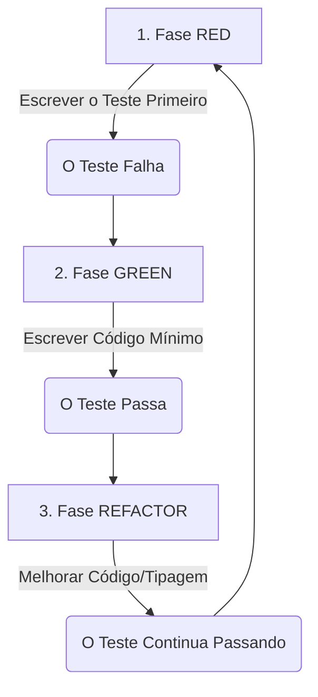

# Estratégia de TDD (Test Driven Development) - CodeHub

## 1. Princípios de Teste do Projeto

Para garantir que o CodeHub seja resiliente e escale sem quebrar funcionalidades antigas, adotaremos a seguinte estratégia de testes:

- **Testes Unitários:** Foco total na camada de `Services` (onde ficam as regras de negócio, como parsing de frontmatter e validação de tags). O banco de dados (MySQL) e o sistema de arquivos (FS) DEVEM ser "mockados" (simulados) nestes testes.
- **Testes de Integração:** Foco nas `Routes` e `Controllers`. Vão testar se a API HTTP (Express) está respondendo com os status codes corretos (200, 201, 400, 404).

## 2. O Ciclo de Trabalho Diário



3. Configuração Padrão de Testes (Setup)
   Sempre que formos rodar os testes, o script base no package.json será:

```json
"scripts": {
"test": "jest",
"test:watch": "jest --watch",
"test:coverage": "jest --coverage"
}
```

Dica de uso: Utilize npm run test:watch durante o desenvolvimento para que o Jest rode automaticamente os testes a cada vez que você salvar um arquivo.

4. Estrutura de Teste Padrão (Template Jest)
   Todo arquivo de teste deve ter a extensão .spec.ts e ficar na mesma pasta do arquivo que está sendo testado. Abaixo está o template base que usaremos para testar os Services do CodeHub:

```typescript
// Exemplo: create-snippet-service.spec.ts
import { CreateSnippetService } from "./create-snippet-service";

describe("CreateSnippetService", () => {
  // 1. Setup inicial (rodado antes de cada teste)
  let createSnippetService: CreateSnippetService;
  let mockRepository: any;

  beforeEach(() => {
    // Simulação do repositório (Mock) para não sujar o banco de dados real
    mockRepository = {
      save: jest.fn().mockResolvedValue(true),
      findByTag: jest.fn(),
    };

    createSnippetService = new CreateSnippetService(mockRepository);
  });

  // 2. Caminho Feliz (Happy Path)
  it("deve conseguir criar um novo snippet com sucesso", async () => {
    const snippetData = {
      title: "Docker Compose Base",
      content: 'version: "3.8"...',
      type: "DevSecOps",
      tags: ["docker", "infra"],
    };

    const result = await createSnippetService.execute(snippetData);

    expect(result).toHaveProperty("id");
    expect(mockRepository.save).toHaveBeenCalledTimes(1);
  });

  // 3. Tratamento de Erro (Sad Path)
  it("não deve permitir a criação de um snippet sem título", async () => {
    const invalidSnippet = {
      title: "", // Título vazio propositalmente
      content: "conteúdo...",
      type: "Backend",
      tags: [],
    };

    // Espera-se que a promessa seja rejeitada com um erro específico
    await expect(
      createSnippetService.execute(invalidSnippet),
    ).rejects.toBeInstanceOf(Error);
  });
});
```

5. Dicionário de Asserções Úteis (Cheat Sheet do Jest)
   Para agilizar o desenvolvimento, aqui estão os comandos mais comuns que utilizaremos:

`expect(valor).toBe(x)`: Compara valores primitivos (textos, números, booleanos).

`expect(objeto).toEqual(x)`: Compara a estrutura inteira de um objeto ou array.

`expect(array).toContain(x)`: Verifica se um item específico existe dentro de uma lista.

`expect(funcao).toThrow()`: Verifica se uma função disparou (jogou) um erro.

`expect(mock).toHaveBeenCalledTimes(1)`: Verifica quantas vezes uma função simulada (mock) foi executada.

```

```
